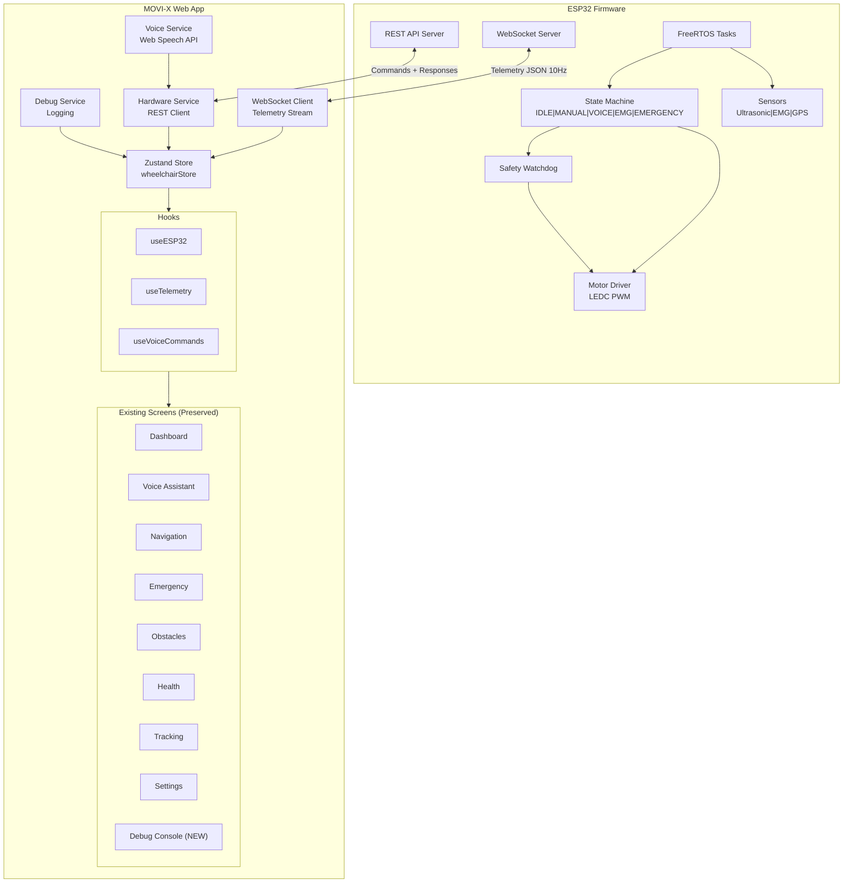
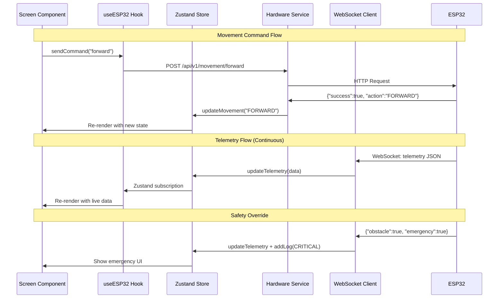

# MOVI-X Smart Wheelchair — Hardware Integration System

Convert the existing static MOVI-X web application into a fully functional real-world AI smart wheelchair control system communicating with ESP32 hardware via WiFi hotspot, WebSocket telemetry, and REST APIs.

## User Review Required

> [!IMPORTANT]
> **The existing app is a Vite + TanStack Start web app, NOT React Native.** The user's request mentions "React Native" and "Zustand", but the codebase uses TanStack Router, TanStack React Query, and Tailwind CSS v4. This plan preserves the existing web stack and adapts the architecture accordingly:
> - **Zustand** → will be added (lightweight, framework-agnostic — works perfectly in web apps)
> - **Voice commands** → Web Speech API (browser-native) instead of React Native Voice
> - **WebSocket** → Native browser WebSocket API
> - **Camera** → `getUserMedia()` browser API for phone camera feed

> [!WARNING]
> **ESP32 Firmware**: This plan creates a complete Arduino/C++ firmware from scratch with the exact pin configuration specified. The firmware will be placed in a new `firmware/` directory at the project root. If existing firmware exists elsewhere, confirm whether to reference or replace it.

## Open Questions

> [!IMPORTANT]
> 1. **ESP32 WiFi Hotspot SSID/Password**: What SSID and password should the ESP32 broadcast? (Plan defaults to `MOVI-X` / `movix1234`)
> 2. **GPS Module**: Which GPS module is connected? (Plan assumes NEO-6M via Serial2)
> 3. **Motor Speed**: What PWM range/max speed should be used? (Plan defaults to 0-255 with 70% max speed cap for safety)
> 4. **Obstacle threshold**: At what distance (cm) should emergency stop trigger? (Plan defaults to 20cm)

---

## Proposed Changes

### Phase 1: ESP32 Firmware (Complete Production Firmware)

Creates the entire ESP32 firmware with FreeRTOS task-based architecture, centralized state machine, WebSocket telemetry, LEDC PWM, and safety watchdog.

#### [NEW] [firmware/movi_x_firmware.ino](file:///d:/BTech/Sem%204/EDI/Final%20Project/MOVI-X-Smartwheelchair-3/firmware/movi_x_firmware.ino)

Complete production firmware (~800 lines). Key architecture:

**Pin Configuration** (exactly as specified):
| Component | Pin(s) |
|-----------|--------|
| EMG | GPIO 34 |
| Ultrasonic TRIG | GPIO 5 |
| Ultrasonic ECHO | GPIO 18 |
| Servo | GPIO 13 |
| LED | GPIO 2 |
| Buzzer | GPIO 4 (moved from GPIO 2) |
| Motor ENA | GPIO 14 |
| Motor ENB | GPIO 15 |
| Motor IN1-IN4 | GPIO 27, 26, 25, 33 |
| GPS RX/TX | GPIO 16, 17 |
| Battery (future) | GPIO 35 |

**FreeRTOS Tasks:**
1. `taskTelemetry` — reads all sensors (ultrasonic, EMG, GPS, battery) every 100ms, publishes to WebSocket
2. `taskMotorControl` — processes movement commands with smooth acceleration/deceleration
3. `taskSafety` — watchdog timer, obstacle detection override, heartbeat monitoring
4. `taskServo` — servo scanning for obstacle mapping

**State Machine:**
```
IDLE → MANUAL → VOICE → EMG → AUTONOMOUS → OBSTACLE_AVOIDANCE → EMERGENCY
```
- Only one active mode at a time
- `EMERGENCY` overrides everything, stops motors immediately
- `OBSTACLE_AVOIDANCE` auto-triggers when distance < threshold

**Communication:**
- **AsyncWebServer** on port 80 for REST APIs
- **WebSocket** on `/ws` for real-time telemetry (JSON, 10Hz)
- **REST API** endpoints:

| Endpoint | Method | Description |
|----------|--------|-------------|
| `/api/v1/movement/forward` | POST | Move forward |
| `/api/v1/movement/backward` | POST | Move backward |
| `/api/v1/movement/left` | POST | Turn left |
| `/api/v1/movement/right` | POST | Turn right |
| `/api/v1/movement/stop` | POST | Stop motors |
| `/api/v1/mode/manual` | POST | Switch to manual mode |
| `/api/v1/mode/voice` | POST | Switch to voice mode |
| `/api/v1/mode/emg` | POST | Switch to EMG mode |
| `/api/v1/mode/emergency` | POST | Emergency stop |
| `/api/v1/status` | GET | Full telemetry JSON |
| `/api/v1/heartbeat` | POST | Heartbeat ping |
| `/api/v1/speed` | POST | Set speed (0-100%) |

**LEDC PWM** (replaces `analogWrite()`):
- Channel 0 → ENA (GPIO 14)
- Channel 1 → ENB (GPIO 15)
- Channel 2 → Servo (GPIO 13)
- 5kHz frequency, 8-bit resolution
- Smooth acceleration: ramp speed over 300ms

**Safety Systems:**
- Watchdog: auto-stop if no heartbeat for 3 seconds
- Obstacle override: emergency stop at < 20cm
- Invalid command rejection with structured JSON errors
- Duplicate command prevention
- Speed limiting (70% max)

**Telemetry JSON** (broadcast via WebSocket at 10Hz):
```json
{
  "distance": 24,
  "mode": "MANUAL",
  "movement": "FORWARD",
  "emg": 2350,
  "latitude": 18.5204,
  "longitude": 73.8567,
  "battery": 82,
  "connection": true,
  "obstacle": false,
  "emergency": false,
  "wifi_clients": 1,
  "uptime": 24000,
  "signal_strength": -48,
  "speed": 70,
  "servo_angle": 90,
  "timestamp": 12345678
}
```

**API Response Format:**
```json
{
  "success": true,
  "action": "FORWARD",
  "timestamp": 12345678,
  "mode": "MANUAL",
  "message": "Moving forward"
}
```

---

### Phase 2: Frontend Service Layer

All new files added to `Movi-app/src/`. No existing files modified in this phase.

#### [NEW] [store/wheelchairStore.ts](file:///d:/BTech/Sem%204/EDI/Final%20Project/MOVI-X-Smartwheelchair-3/Movi-app/src/store/wheelchairStore.ts)

Central Zustand store for all wheelchair state. Holds:
- `telemetry` — latest sensor data from WebSocket
- `connectionStatus` — `disconnected | connecting | connected | error`
- `esp32Ip` — configurable IP (default `192.168.4.1`)
- `currentMode` — `IDLE | MANUAL | VOICE | EMG | AUTONOMOUS | EMERGENCY`
- `currentMovement` — `STOP | FORWARD | BACKWARD | LEFT | RIGHT`
- `heartbeatLatency` — ms round-trip
- `reconnectAttempts` — counter
- `debugLogs` — array of timestamped log entries
- Actions: `sendCommand()`, `setMode()`, `emergencyStop()`, `addLog()`, `connect()`, `disconnect()`

#### [NEW] [services/hardwareService.ts](file:///d:/BTech/Sem%204/EDI/Final%20Project/MOVI-X-Smartwheelchair-3/Movi-app/src/services/hardwareService.ts)

REST API client for ESP32 commands. Uses `fetch()` (no Axios needed — reduces bundle size):
- `sendMovement(direction)` → POST to `/api/v1/movement/{direction}`
- `setMode(mode)` → POST to `/api/v1/mode/{mode}`
- `sendHeartbeat()` → POST to `/api/v1/heartbeat`
- `getStatus()` → GET `/api/v1/status`
- `setSpeed(percent)` → POST `/api/v1/speed`
- `emergencyStop()` → POST `/api/v1/mode/emergency`
- All responses parsed as structured JSON
- Timeout handling (3s per request)
- Error logging to debug store

#### [NEW] [services/websocketService.ts](file:///d:/BTech/Sem%204/EDI/Final%20Project/MOVI-X-Smartwheelchair-3/Movi-app/src/services/websocketService.ts)

WebSocket client for real-time telemetry:
- Connects to `ws://{esp32Ip}/ws`
- Auto-reconnect with exponential backoff (1s, 2s, 4s, 8s, max 30s)
- Parses incoming telemetry JSON, updates Zustand store
- Connection state tracking
- Heartbeat ping every 1 second
- `connect()`, `disconnect()`, `isConnected()`, `onTelemetry(callback)`

#### [NEW] [services/debugService.ts](file:///d:/BTech/Sem%204/EDI/Final%20Project/MOVI-X-Smartwheelchair-3/Movi-app/src/services/debugService.ts)

Centralized debug logging system:
- Log levels: `INFO`, `WARNING`, `ERROR`, `CRITICAL`
- Categories: `CONNECTION`, `API`, `SENSOR`, `MOTOR`, `SAFETY`, `VOICE`, `SYSTEM`
- Each log entry: `{ timestamp, level, category, message, data? }`
- Max 500 logs in memory (ring buffer)
- `exportLogs()` → downloads as JSON file
- `filterLogs(level?, category?)` → filtered view
- Hooks into hardware service and WebSocket service automatically

#### [NEW] [services/voiceService.ts](file:///d:/BTech/Sem%204/EDI/Final%20Project/MOVI-X-Smartwheelchair-3/Movi-app/src/services/voiceService.ts)

Voice command processing using Web Speech API:
- `startListening()` / `stopListening()` — continuous recognition
- Wake word detection: "Hey Movi"
- Command parser: maps recognized speech to hardware commands
  - "move forward" / "go forward" → `movement/forward`
  - "stop" / "halt" → `movement/stop`
  - "turn left" / "go left" → `movement/left`
  - "turn right" / "go right" → `movement/right`
  - "emergency" / "help" → `mode/emergency`
  - "manual mode" → `mode/manual`
  - "voice mode" → `mode/voice`
  - "EMG mode" → `mode/emg`
- Speech synthesis for feedback ("Moving forward", "Emergency stop activated")
- Fuzzy matching for command recognition

#### [NEW] [hooks/useESP32.ts](file:///d:/BTech/Sem%204/EDI/Final%20Project/MOVI-X-Smartwheelchair-3/Movi-app/src/hooks/useESP32.ts)

React hook wrapping the hardware + WebSocket services:
- Auto-connects WebSocket on mount, disconnects on unmount
- Starts heartbeat interval (1s)
- Exposes: `{ telemetry, connectionStatus, latency, sendCommand, setMode, emergencyStop, isConnected }`
- Tracks reconnect attempts
- Logs all connection events to debug service

#### [NEW] [hooks/useTelemetry.ts](file:///d:/BTech/Sem%204/EDI/Final%20Project/MOVI-X-Smartwheelchair-3/Movi-app/src/hooks/useTelemetry.ts)

Derived telemetry hook with computed values:
- `batteryLevel`, `batteryStatus` (critical/low/good/full)
- `distanceStatus` (safe/warning/danger)
- `isObstacleDetected`
- `gpsCoordinates` formatted
- `uptimeFormatted`
- `signalStrengthLabel` (excellent/good/fair/poor)

#### [NEW] [hooks/useVoiceCommands.ts](file:///d:/BTech/Sem%204/EDI/Final%20Project/MOVI-X-Smartwheelchair-3/Movi-app/src/hooks/useVoiceCommands.ts)

React hook for voice command integration:
- `{ isListening, transcript, lastCommand, startListening, stopListening, isSupported }`
- Integrates voice service with hardware service
- Auto-executes recognized commands
- Provides chat message history for the voice screen

#### [NEW] [utils/logger.ts](file:///d:/BTech/Sem%204/EDI/Final%20Project/MOVI-X-Smartwheelchair-3/Movi-app/src/utils/logger.ts)

Utility for structured logging:
- `logger.info(category, message, data?)`
- `logger.warn(category, message, data?)`
- `logger.error(category, message, data?)`
- `logger.critical(category, message, data?)`
- Writes to both console and debug store

#### [NEW] [utils/commandParser.ts](file:///d:/BTech/Sem%204/EDI/Final%20Project/MOVI-X-Smartwheelchair-3/Movi-app/src/utils/commandParser.ts)

Parses natural language into wheelchair commands:
- Fuzzy string matching with Levenshtein distance
- Command confidence scoring
- Returns `{ command, confidence, rawText }`
- Handles aliases ("go", "move", "drive", "navigate")

---

### Phase 3: Screen Integration (Preserve Existing UI)

Minimal, surgical modifications to existing screens — only adding hooks and binding data. **No layout/style/animation changes.**

#### [MODIFY] [__root.tsx](file:///d:/BTech/Sem%204/EDI/Final%20Project/MOVI-X-Smartwheelchair-3/Movi-app/src/routes/__root.tsx)

- Import and initialize the ESP32 connection provider at the root level
- Add a `<ConnectionStatusBar>` component (thin colored bar at top: green=connected, yellow=connecting, red=disconnected)
- Add the debug console route to navigation hiding logic

#### [MODIFY] [home.tsx](file:///d:/BTech/Sem%204/EDI/Final%20Project/MOVI-X-Smartwheelchair-3/Movi-app/src/routes/home.tsx)

Dashboard integration — connect existing cards to live telemetry:
- Status hero: bind "All systems active" → actual connection status
- "Connected" badge → live WebSocket connection state with pulse animation
- Battery stat → `telemetry.battery`%
- Speed stat → computed from movement state
- Add distance indicator from ultrasonic
- Add mode indicator (MANUAL/VOICE/EMG)
- AI assistant widget → show last voice command result
- All using `useESP32()` and `useTelemetry()` hooks

#### [MODIFY] [voice.tsx](file:///d:/BTech/Sem%204/EDI/Final%20Project/MOVI-X-Smartwheelchair-3/Movi-app/src/routes/voice.tsx)

Voice assistant integration:
- Mic button → `useVoiceCommands()` hook — starts/stops listening
- Waveform animation → active when listening
- Chat bubbles → real conversation history from voice commands
- Suggestions → trigger actual commands when tapped
- Response bubbles → show ESP32 command results
- "Tap to speak" → changes to "Listening..." when active

#### [MODIFY] [navigation.tsx](file:///d:/BTech/Sem%204/EDI/Final%20Project/MOVI-X-Smartwheelchair-3/Movi-app/src/routes/navigation.tsx)

- "Start Voice-Guided Route" button → connects to voice mode
- Add movement control overlay (D-pad: forward/back/left/right/stop)
- Accessibility score → based on obstacle detection data
- GPS coordinates → from telemetry
- Add speed control slider

#### [MODIFY] [sos.tsx](file:///d:/BTech/Sem%204/EDI/Final%20Project/MOVI-X-Smartwheelchair-3/Movi-app/src/routes/sos.tsx)

Emergency system integration:
- SOS button hold → triggers `emergencyStop()` on ESP32
- Haptic feedback via `navigator.vibrate()`
- "Call Caretaker" → opens phone dialer
- "Share Location" → uses GPS from telemetry
- Alert history → populated from debug logs (CRITICAL events)
- Auto-trigger SOS on obstacle emergency

#### [MODIFY] [obstacles.tsx](file:///d:/BTech/Sem%204/EDI/Final%20Project/MOVI-X-Smartwheelchair-3/Movi-app/src/routes/obstacles.tsx)

Obstacle detection integration:
- Distance reading → live from ultrasonic sensor
- Detection boxes → positioned based on servo scan angle
- "Emergency Stop" button → calls `emergencyStop()`
- "LIVE" badge → actual WebSocket connection indicator
- Voice announcement → "Obstacle ahead" via speech synthesis
- Camera feed → phone camera via `getUserMedia()` (not ESP32-CAM)

#### [MODIFY] [health.tsx](file:///d:/BTech/Sem%204/EDI/Final%20Project/MOVI-X-Smartwheelchair-3/Movi-app/src/routes/health.tsx)

- EMG reading displayed as "Muscle Activity" metric
- Battery health from telemetry
- Connection uptime tracking
- System diagnostics summary

#### [MODIFY] [tracking.tsx](file:///d:/BTech/Sem%204/EDI/Final%20Project/MOVI-X-Smartwheelchair-3/Movi-app/src/routes/tracking.tsx)

- GPS coordinates from telemetry → update map position dot
- Battery/Speed/Status from live data
- "LIVE" indicator → actual WebSocket state
- Safety notifications → from debug log events

#### [MODIFY] [settings.tsx](file:///d:/BTech/Sem%204/EDI/Final%20Project/MOVI-X-Smartwheelchair-3/Movi-app/src/routes/settings.tsx)

- Add "Hardware" settings section:
  - ESP32 IP address field (editable)
  - Connection status indicator
  - Reconnect button
  - Speed limit slider
  - Obstacle threshold setting
- Add "Debug" link → navigate to debug console
- Version → show firmware version from telemetry

#### [MODIFY] [AppShell.tsx](file:///d:/BTech/Sem%204/EDI/Final%20Project/MOVI-X-Smartwheelchair-3/Movi-app/src/components/AppShell.tsx)

- Add connection status indicator (small dot) in the bottom nav
- Add debug console tab (hidden by default, toggled from settings)

---

### Phase 4: Debug Console Screen

#### [NEW] [debug.tsx](file:///d:/BTech/Sem%204/EDI/Final%20Project/MOVI-X-Smartwheelchair-3/Movi-app/src/routes/debug.tsx)

Full debug console screen with existing UI design language:

**Layout:**
- ScreenHeader with "Debug Console" title
- Connection status card (IP, signal, latency, uptime, reconnects)
- Tab bar: `All | Connection | Sensors | Motors | Safety`
- Live scrolling log view with color-coded entries:
  - `INFO` → primary/teal
  - `WARNING` → warning/amber
  - `ERROR` → destructive/red
  - `CRITICAL` → destructive with pulse animation
- Each log entry: `[HH:MM:SS.ms] [LEVEL] [CATEGORY] message`

**Features:**
- Real-time log streaming
- Filter by level and category
- Search logs
- Export as JSON
- Clear logs
- Telemetry raw data panel (collapsible)
- Send raw commands (text input → API call)
- Connection test button (ping ESP32)

**Sensor Debug Panel:**
- Ultrasonic: raw distance, threshold, trigger state
- EMG: raw value, filtered value, threshold
- GPS: lat/lng, lock status
- Battery: voltage, percentage

**Motor Debug Panel:**
- Direction, PWM values (ENA/ENB)
- Movement state, active stop triggers

#### [NEW] [components/ConnectionStatusBar.tsx](file:///d:/BTech/Sem%204/EDI/Final%20Project/MOVI-X-Smartwheelchair-3/Movi-app/src/components/ConnectionStatusBar.tsx)

Thin status bar shown at top of all screens:
- Green pulsing → Connected (shows latency)
- Amber → Connecting/Reconnecting (shows attempt count)
- Red → Disconnected (tap to reconnect)
- Slides in/out with animation
- Uses existing design tokens (border-radius, shadows, colors)

#### [NEW] [components/MovementControls.tsx](file:///d:/BTech/Sem%204/EDI/Final%20Project/MOVI-X-Smartwheelchair-3/Movi-app/src/components/MovementControls.tsx)

Floating D-pad control overlay for the navigation screen:
- 5 buttons: Forward, Backward, Left, Right, Stop (center)
- Uses existing gradient/shadow design system
- Touch-and-hold for continuous movement
- Visual feedback on press (scale animation)
- Speed indicator ring around stop button

---

### Phase 5: Package Updates & Configuration

#### [MODIFY] [package.json](file:///d:/BTech/Sem%204/EDI/Final%20Project/MOVI-X-Smartwheelchair-3/Movi-app/package.json)

Add dependency:
```diff
+ "zustand": "^5.0.0"
```

No other dependencies needed — WebSocket, Web Speech API, `fetch()`, and `getUserMedia()` are all browser-native.

---

## Architecture Diagram



## Data Flow



---

## Verification Plan

### Automated Tests

1. **Firmware compilation**: Verify Arduino sketch compiles for ESP32 board
   ```bash
   arduino-cli compile --fqbn esp32:esp32:esp32 firmware/movi_x_firmware.ino
   ```

2. **Frontend build**: Verify no TypeScript errors
   ```bash
   cd Movi-app && npm run build
   ```

3. **Browser test**: Launch dev server and verify all screens render with mock data (no ESP32 needed)

### Manual Verification

1. **ESP32 Integration Test**:
   - Flash firmware to ESP32
   - Connect phone to `MOVI-X` WiFi hotspot
   - Open app at `http://192.168.4.1:5173` (or deployed URL)
   - Verify dashboard shows live telemetry
   - Test movement commands via D-pad
   - Test voice commands ("Hey Movi, move forward")
   - Verify emergency stop button
   - Check debug console shows live logs

2. **Safety Test**:
   - Block ultrasonic sensor → verify auto-stop
   - Disconnect WiFi → verify motors stop within 3s
   - Send invalid command → verify rejection

3. **UI Preservation Test**:
   - Compare all screens before/after — layouts, animations, and styles must be identical
   - Only data values should change (static → live)

---

## File Summary

| Phase | New Files | Modified Files |
|-------|-----------|----------------|
| 1. Firmware | 1 | 0 |
| 2. Services | 9 | 0 |
| 3. Screens | 0 | 8 |
| 4. Debug | 3 | 1 |
| 5. Config | 0 | 1 |
| **Total** | **13** | **10** |

## Execution Order

1. Install Zustand dependency
2. Create utility files (`logger.ts`, `commandParser.ts`)
3. Create Zustand store (`wheelchairStore.ts`)
4. Create service layer (`hardwareService.ts`, `websocketService.ts`, `debugService.ts`, `voiceService.ts`)
5. Create hooks (`useESP32.ts`, `useTelemetry.ts`, `useVoiceCommands.ts`)
6. Create new components (`ConnectionStatusBar.tsx`, `MovementControls.tsx`)
7. Create debug console screen (`debug.tsx`)
8. Modify existing screens (home → voice → navigation → sos → obstacles → health → tracking → settings)
9. Modify `AppShell.tsx` and `__root.tsx`
10. Create ESP32 firmware
11. Verify build + test
